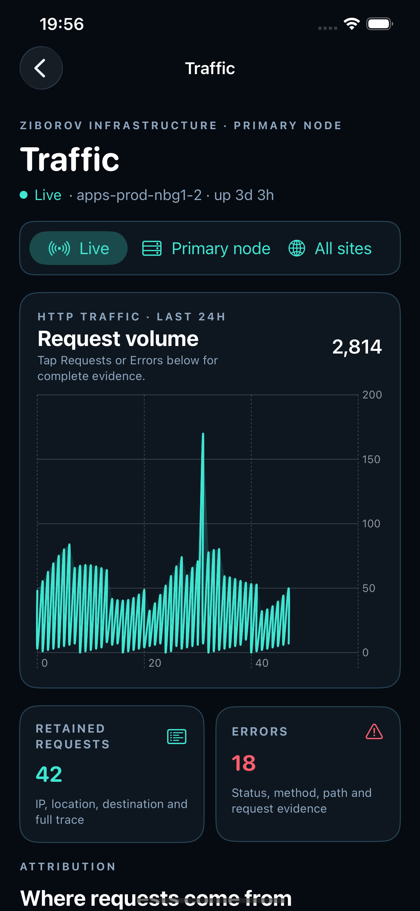
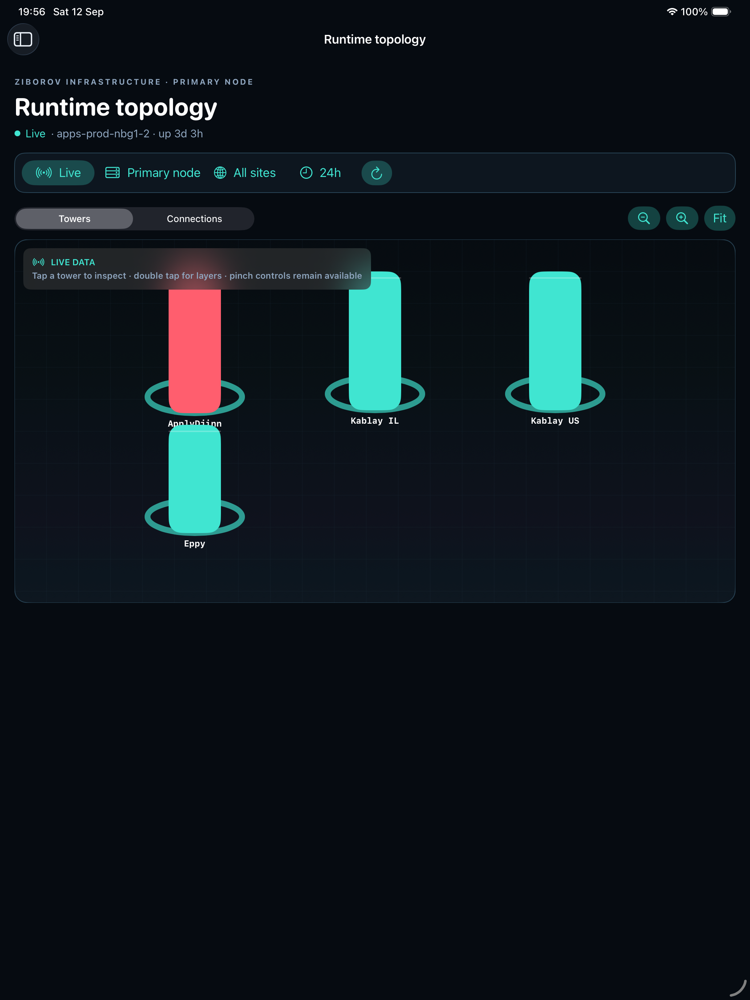

# Hostwatch for iPhone and iPad

Native SwiftUI control-plane client for Hostwatch. It uses the same signed-in session and REST API as the web application. There is no public demo or registration flow.

## Product structure

- **Overview** — host resources and capacity with resource drilldowns.
- **Traffic** — requests, errors, destinations, sources, locations and retained evidence.
- **Incidents & risks** — operational incidents, anomaly signals and vulnerabilities in separate tabs.
- **Runtime topology** — tower and connection views of running workloads.
- **Workloads** — project traffic, processes, storage, limits and controls.
- **Traffic policies** — bandwidth, anomaly and IP/country access rules.
- **Environment** — per-project environment variable management.
- **Code health** — repository evidence, findings and vulnerabilities.
- **Automations**, **Access**, **Organization** — scheduled services, users and license/deployment settings.

The app supports the hosted control plane and licensed enterprise installations. The control-plane URL can be changed on the sign-in screen. Enterprise licenses remain created and verified by the controller REST API; the mobile app only displays and installs a signed license for an authorized owner.

## Build

```bash
xcodegen generate
xcodebuild -project Hostwatch.xcodeproj -scheme Hostwatch \
  -sdk iphonesimulator -configuration Debug CODE_SIGNING_ALLOWED=NO build
```

For local screenshot and UI verification only, launch the Debug build with `HOSTWATCH_FIXTURES=1`. This switch is read from the process environment and is absent from the production interface.

No CI/CD workflow is included. Release signing and distribution are intentionally manual.

## Verified layouts

| iPhone traffic | iPad runtime topology |
| --- | --- |
|  |  |

Additional checked states are stored in `docs/screenshots`: sign in, iPhone overview and iPad overview.
