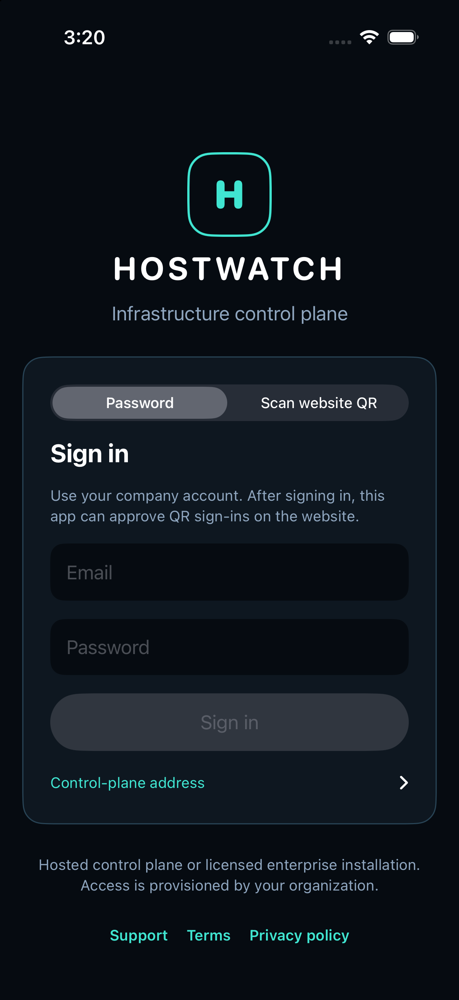

# Hostwatch for iPhone and iPad

Native SwiftUI control-plane client for Hostwatch. The iPhone and iPad app is intended for **public App Store distribution**, while access to a control plane is provisioned by an organization. It uses the same signed-in session and REST API as the web application. There is no public demo or registration flow.

**Version 1.0.5 (8):** fixes password and authenticator error messages, starts a fresh password sign-in after expired device authorization, and preserves renewed session protection when the app backgrounds. Response cookies are saved before the next request or Keychain snapshot; password visibility can be toggled while entering credentials. All 34 tests passed on 2026-09-29, including an explicitly configured live controller sign-in from the iOS simulator. A signed Debug build is prepared. Physical-camera/Face ID testing and a validated App Store distribution archive remain required. See [submission materials and release checklist](docs/APP_STORE.md).

## Product structure

- **Overview** — host resources and capacity with resource drilldowns. A loader stays on the page while that snapshot arrives instead of fading the whole interface.
- **Database** — its own tab for running data-service containers and observed files. SQLite files can list tables and preview rows; PostgreSQL/Redis stay at container evidence. File size is disk evidence; query rate and cache hit ratio require a dedicated exporter.
- **Cleanup** — preview and explicitly remove only old APT downloads, generated manual-page caches, and unused Docker build records. The disk inspector links to the same section. Actual filesystem space freed by Docker may be lower than its virtual cache size.
- **Network** — the host Network card shows all interface ingress and egress and a live local/remote port socket snapshot. Port counts are not per-port byte totals.
- **Two QR paths** — a signed-in app can approve a website sign-in under More → Account security → Approve a sign-in. To sign in to the app by QR, first sign in on the website with a password, then open Organization → Account security → Sign in on iPhone or iPad. The app's first sign-in defaults to email and password.
- **Traffic** — requests, errors, destinations, sources, locations and retained evidence. External clients and our services are split and badged; referrers stay campaign labels, not callers. The visitor map uses MapKit annotations for located public clients and keeps our services off the map, with a located / our services / no-geo count. Long destination and request lists autoload in pages, and an open control launches a GET destination in the system browser.
- **Time and error evidence** — charts use local time on the horizontal axis. Unparsed Nginx requests with no usable Host are labeled as unmapped instead of inventing a website URL.
- **Incidents & risks** — operational incidents, anomaly signals and vulnerabilities in separate tabs.
- **Errors** — More → Observe. HTTP 4xx/5xx grouped by project. Opening one request shows the project, earlier matches on the same path, and nearby Docker logs when a container can be attributed. Markdown import/export covers those errors and Weavatrix/CVE advisories.
- **Reclaim advisor** — Cleanup and Disk classify measured host paths as safe, review, or protected so you can see what may be deleted without touching databases, backups, or container layers.
- **Runtime topology** — a native SceneKit cyberboard aligned with the Electron RepoLens board. **Towers** shows stacked runtime + Weavatrix layers and structure roads. **Traffic** hides those layers and runs live packets on the same Manhattan roads, colored by origin: teal public clients, amber our services, green our data. Selecting a project explodes it into frontend, backend and data towers. Side labels stay pinned to their layer; if there are too many, they page with ▲/▼ instead of overlapping. One legend sits at the bottom left. Drag orbits without flipping, two fingers pan, pinch zooms, tap frames a tower from the right.
- **Fleet** — hybrid edge/home peers, public IP change history, heartbeat freshness, admission (slots, disk, stale), and home load-scaling settings.
- **Workloads** — project traffic, processes, storage, limits and controls.
- **Traffic policies** — bandwidth, anomaly and IP/country access rules.
- **Managed secrets** — the Environment page keeps client-encrypted `.env` links separate from node-stored vault secrets. Owners can create and rotate values, set expiry, issue scoped application tokens with IP and read limits, review access, and revoke grants. MCP insertion is independently disabled by default in the MCP governance screen.
- **MCP** — under Control: turn MCP off, allow or deny reads and changes, block tools, cap hourly mutations, and see which computers are talking to this company through MCP plus a redacted tool history. Limits are enforced on the Hostwatch node; a local MCP process cannot lift them.
- **Environment** — per-project variables with explicit Text/Secret choice, encrypted vault application and shared values assigned to multiple projects. Owners can rotate a shared value and retry projects whose sync failed.
- **Code health** — repository evidence, findings and vulnerabilities.
- **Automations**, **Access**, **Organization** — scheduled services, users and license/deployment settings.

The app supports the hosted control plane and licensed enterprise installations. The control-plane URL can be changed on the sign-in screen. Enterprise licenses remain created and verified by the controller REST API; the mobile app only displays and installs a signed license for an authorized owner.

On iPhone or iPad, sign in by scanning the one-time QR shown in **Organization → Account security → Sign in on iPhone or iPad** on an already signed-in Hostwatch website. Compare the six-digit number on both screens and approve on the website. The QR expires after two minutes and can only sign in the device that claimed it. QR links use the registered `hostwatch://` scheme to open the installed app from the system camera; the app validates the control-plane origin. Release signing also declares the hosted universal-link domain. Password and authenticator-code sign-in remain available. **More → Account security** lets an account enroll, replace, or disable its authenticator and approve another device's website sign-in with the camera or a short manual pairing code. That approval asks for Face ID or the device passcode.

The minimum deployment target is iOS 15, so the same build runs on current iPhones and older iPads such as iPad mini 4 (15.8). The four primary areas are Overview, Traffic, Database and Runtime; only the selected tab stays mounted. Workloads and less frequent controls are under **More**. iPad keeps a sidebar. Links to a request destination or external advisory open in the system browser, outside the app. Live refresh loads only the visible page: topology pulses host/site snapshots every 3s and the heavier inventory every 30s; other pages refresh every 8s without re-downloading request/error buffers.

On launch, a native Hostwatch splash stays visible while the saved server session is checked. After the first successful sign-in the session cookies are stored in the device keychain so they survive app death; **Face ID / Touch ID / passcode** (on by default when the device can evaluate it) unlocks that session on the next launch and after the app goes to the background. The eight-hour access cookie is automatically renewed with a rotating device credential valid for up to 90 days of inactivity. The controller stores only its hash; Keychain holds the actual credential. Password or two-factor changes revoke the saved authorization. Signing out removes and revokes the saved session. This is an on-device unlock for a stored control-plane session, not a substitute for account two-factor policy. Disk scans show progress and errors, and directory drilldown preserves the host summary while loading child entries.

## Build

```bash
xcodegen generate
xcodebuild -project Hostwatch.xcodeproj -scheme Hostwatch \
  -sdk iphonesimulator -configuration Debug CODE_SIGNING_ALLOWED=NO build
```

The simulator test suite covers expired-device password retry, rejected passwords and authenticator codes, rate limiting, response-cookie persistence, and saving after renewal. The optional live sign-in test runs only when `HOSTWATCH_TEST_ORIGIN`, `HOSTWATCH_TEST_EMAIL` and `HOSTWATCH_TEST_PASSWORD` are explicitly supplied to the test runner; it signs out its own temporary session. Never commit credentials. Xcode command-line test runner variables can be supplied using the `TEST_RUNNER_` prefix.

For local UI development only, a Debug build may be launched with `HOSTWATCH_FIXTURES=1`. These values are fabricated test fixtures and display a prominent **SAMPLE DATA · DEBUG BUILD** notice instead of a Live status. A Release build ignores the flag and requires a real, authenticated control plane. No fixture screenshot is used as an App Store asset.

All app screens use SwiftUI, SceneKit, MapKit and direct JSON API calls. There are no embedded web pages, WebViews or bundled HTML assets. A shared `Hostwatch` scheme and an Xcode Cloud workflow are configured for this iOS repository. The controller and Go agent remain separate products; this iOS workflow does not build or publish them. Public App Store distribution still requires a validated archive, App Store Connect metadata, review credentials, on-device testing and App Review approval.

To run on a physical iPhone, open `Hostwatch.xcodeproj` in Xcode and select your device. Automatic signing uses the configured developer team; Xcode must have an authenticated Apple Account. For an Xcode Cloud archive, use the shared `Hostwatch` scheme, verify the selected branch and stable Xcode version, and explicitly enable App Store Connect distribution. Do not turn on automatic public release.

Apple reviewers need a dedicated, working account on a live control plane with representative data and any second-factor instructions. The sign-in screen alone is insufficient for review. The public privacy and support URLs, screenshots of the shipping build, app privacy answers, review notes and tester coverage must match the actual service before submission.

## License

The iOS source is public for inspection and evaluation but remains proprietary. It is **not MIT-licensed**. See [LICENSE](LICENSE). The backend, controller and agent are not included or licensed here.

For App Store review and users, see the [privacy policy](PRIVACY.md) and [support](SUPPORT.md). These links are also available from the signed-out app.

## Screenshots



Previous simulator capture of version 1.0.4 against an isolated local controller. No sample traffic or customer credentials are shown; version 1.0.5 also includes a password visibility control.

Only captures from an authenticated shipping build should be uploaded to App Store Connect. Development fixture images under `docs/screenshots/` explicitly show SAMPLE DATA and are not current server telemetry or Store assets. See [capture checklist](docs/APP_STORE.md#screenshots); the listing must include both supported device families.

Public policies: [Privacy](https://gethostwatch.com/privacy), [Terms of use](https://gethostwatch.com/terms), [Support](https://gethostwatch.com/support). The same links are available before sign-in and in Account security.
