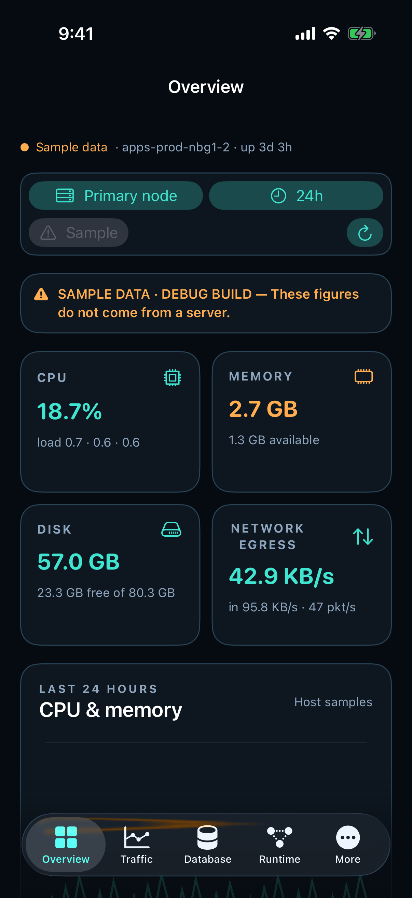
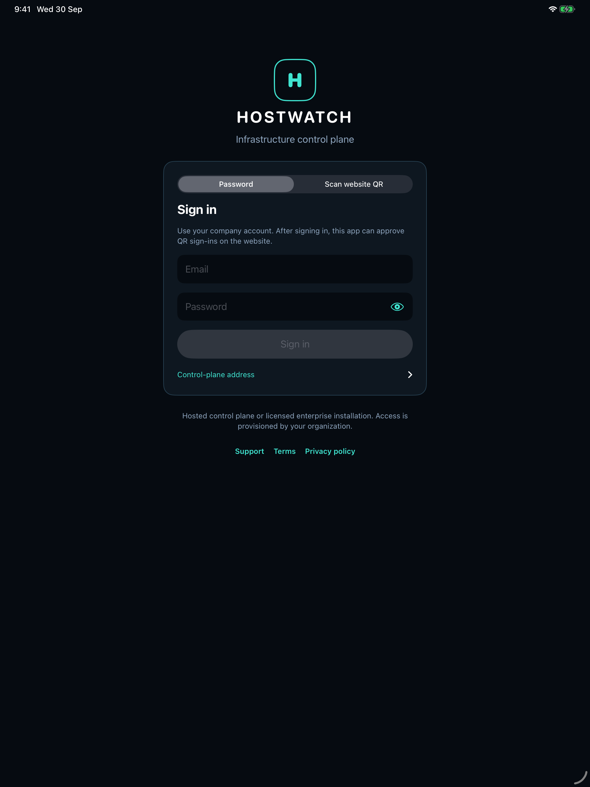

# Hostwatch for iPhone and iPad

Native SwiftUI control-plane client for Hostwatch. The iPhone and iPad app is intended for **public App Store distribution**, while access to a control plane is provisioned by an organization. It uses the same signed-in session and REST API as the web application. There is no public demo or registration flow.

**Version 1.0.9 (18):** available in the internal **Hostwatch Internal** TestFlight group. Pull-to-refresh now uses only the system spinner, a retry clears the previous error, and an in-progress reload cannot be started again. The previous build added normal and peak memory limits to Workloads. See [submission materials and release checklist](docs/APP_STORE.md) for the current TestFlight and App Store status.

## Install and first setup

The iOS beta is distributed by TestFlight invitation. Request access from your organization administrator or [Hostwatch support](mailto:serhii.ziborov@gmail.com?subject=Hostwatch%20iOS%20TestFlight). There is no public download link yet.

1. On an iPhone or iPad running iOS/iPadOS 16 or later, install [Apple's TestFlight app](https://apps.apple.com/app/testflight/id899247664), open the invitation sent to your Apple Account, then accept and install Hostwatch.
2. On the Hostwatch sign-in screen, leave the hosted address in place or expand **Control-plane address** and enter the HTTPS address supplied by your administrator.
3. Sign in with your organization email and password, followed by an authenticator code if requested. Alternatively, choose **Scan website QR** and scan the device sign-in code from an already authenticated website session under **Organization → Account security → Sign in on iPhone or iPad**.
4. Select a node on **Overview** and pull down to refresh. Traffic, Database and Runtime use the selected node and your account permissions.

If Overview says **No host snapshot**, confirm the selected node has data on the website, update Hostwatch in TestFlight and refresh. If an error persists, report the exact text, app version, node name and time to support. Never send passwords or API keys. The public [setup and troubleshooting guide](https://gethostwatch.com/support#ios-setup) has more detail.

## Product structure

- **Overview** — host resources and capacity with resource drilldowns. Pull down to refresh with the system indicator; the page's own loading indicator is reserved for other reloads. A loader stays on the page while the first snapshot arrives instead of fading the whole interface.
- **Database** — its own tab for running data-service containers and observed files. SQLite files can list tables and preview rows; PostgreSQL stays at container evidence; Redis/Valkey also shows native INFO counters. File size is disk evidence; SQL query rates require a dedicated exporter.
- **Cleanup** — preview and explicitly remove only old APT downloads, generated manual-page caches, and unused Docker build records and opted-in Podman intermediate-image cache per runtime. The disk inspector links to the same section. Actual filesystem space freed by container cache cleanup may be lower than its virtual cache size.
- **Network** — the host Network card shows all interface ingress and egress and a live local/remote port socket snapshot. Port counts are not per-port byte totals.
- **Two QR paths** — a signed-in app can approve a website sign-in under More → Account security → Approve a sign-in. To sign in to the app by QR, first sign in on the website with a password, then open Organization → Account security → Sign in on iPhone or iPad. The app's first sign-in defaults to email and password.
- **Traffic** — requests, errors, destinations, sources, locations and retained evidence. External clients and our services are split and badged; referrers stay campaign labels, not callers. The visitor map uses MapKit annotations for located public clients and keeps our services off the map, with a located / our services / no-geo count. Long destination and request lists autoload in pages, and an open control launches a GET destination in the system browser.
- **Time and error evidence** — charts use local time on the horizontal axis. Unparsed Nginx requests with no usable Host are labeled as unmapped instead of inventing a website URL.
- **Incidents & risks** — operational incidents, anomaly signals and vulnerabilities in separate tabs.
- **Errors** — More → Observe. HTTP 4xx/5xx grouped by project with totals for the selected window, separate 5xx and Nginx 444 counts, and bounded examples covering distinct status codes. Opening one request shows protocol/upstream evidence, the observed response layer, earlier matches and nearby Docker or Podman logs when a container can be attributed. Markdown export carries detailed evidence and coverage; import also supports Weavatrix/CVE advisories.
- **Reclaim advisor** — Cleanup and Disk classify measured host paths as safe, review, or protected so you can see what may be deleted without touching databases, backups, or container layers.
- **Runtime topology** — a native SceneKit cyberboard aligned with the Electron RepoLens board. **Towers** shows stacked runtime + Weavatrix layers and structure roads. **Traffic** hides those layers and runs live packets on the same Manhattan roads, colored by origin: teal public clients, amber our services, green our data. Selecting a project explodes it into frontend, backend and data towers. Side labels stay pinned to their layer; if there are too many, they page with ▲/▼ instead of overlapping. One legend sits at the bottom left. Drag orbits without flipping, two fingers pan, pinch zooms, tap frames a tower from the right.
- **Fleet** — hybrid edge/home peers, public IP change history, heartbeat freshness, admission (slots, disk, stale), and home load-scaling settings.
- **Workloads** — project traffic, processes, storage, limits and controls, including each site's normal and peak memory limits and overflow status.
- **Traffic policies** — bandwidth, anomaly and IP/country access rules on capable Linux nodes. A host-only Mac shows these controls as unavailable instead of reusing policy data from another node.
- **Managed secrets** — the Environment page keeps client-encrypted `.env` links separate from node-stored vault secrets. Owners can create and rotate values, set expiry, issue scoped application tokens with IP and read limits, review access, and revoke grants. MCP insertion is independently disabled by default in the MCP governance screen.
- **MCP** — under Control: turn MCP off, allow or deny reads and changes, block tools, cap hourly mutations, and see which computers are talking to this company through MCP plus a redacted tool history. Limits are enforced on the Hostwatch node; a local MCP process cannot lift them.
- **Environment** — per-project variables with explicit Text/Secret choice, encrypted vault application and shared values assigned to multiple projects. Owners can rotate a shared value and retry projects whose sync failed.
- **Code health** — repository evidence, findings and vulnerabilities.
- **Automations**, **Access**, **Organization** — scheduled services, users and license/deployment settings.

The app supports the hosted control plane and licensed enterprise installations. The control-plane URL can be changed on the sign-in screen. Enterprise licenses remain created and verified by the controller REST API; the mobile app only displays and installs a signed license for an authorized owner.

On iPhone or iPad, sign in by scanning the one-time QR shown in **Organization → Account security → Sign in on iPhone or iPad** on an already signed-in Hostwatch website. Compare the six-digit number on both screens and approve on the website. The QR expires after two minutes and can only sign in the device that claimed it. QR links use the registered `hostwatch://` scheme to open the installed app from the system camera; the app validates the control-plane origin. Release signing also declares the hosted universal-link domain. Password and authenticator-code sign-in remain available. **More → Account security** lets an account enroll, replace, or disable its authenticator and approve another device's website sign-in with the camera or a short manual pairing code. That approval asks for Face ID or the device passcode.

The app's minimum deployment target is iOS 15, but Apple's TestFlight app currently requires iOS/iPadOS 16 or later. The four primary areas are Overview, Traffic, Database and Runtime; only the selected tab stays mounted. Workloads and less frequent controls are under **More**. iPad keeps a sidebar. Links to a request destination or external advisory open in the system browser, outside the app. Live refresh loads only the visible page: topology pulses host/site snapshots every 3s and the heavier inventory every 30s; other pages refresh every 8s without re-downloading request/error buffers.

On launch, a native Hostwatch splash stays visible while the saved server session is checked. After the first successful sign-in the session cookies are stored in the device keychain so they survive app death; **Face ID / Touch ID / passcode** (on by default when the device can evaluate it) unlocks that session on the next launch and after the app goes to the background. The eight-hour access cookie is automatically renewed with a rotating device credential valid for up to 90 days of inactivity. The controller stores only its hash; Keychain holds the actual credential. Password or two-factor changes revoke the saved authorization. Signing out removes and revokes the saved session. This is an on-device unlock for a stored control-plane session, not a substitute for account two-factor policy. Disk scans show progress and errors, and directory drilldown preserves the host summary while loading child entries.

## Build

```bash
xcodegen generate
xcodebuild -project Hostwatch.xcodeproj -scheme Hostwatch \
  -sdk iphonesimulator -configuration Debug CODE_SIGNING_ALLOWED=NO build
```

The simulator test suite covers expired-device password retry, rejected passwords and authenticator codes, rate limiting, response-cookie persistence, and saving after renewal. The optional live sign-in test runs only when `HOSTWATCH_TEST_ORIGIN`, `HOSTWATCH_TEST_EMAIL` and `HOSTWATCH_TEST_PASSWORD` are explicitly supplied to the test runner; it signs out its own temporary session. Never commit credentials. Xcode command-line test runner variables can be supplied using the `TEST_RUNNER_` prefix.

Docker/Podman compatibility checks also cover runtime-scoped data-service identity,
missing telemetry and protected Podman storage. The updated simulator suite ran
36 tests on 2026-09-29 with no failures; the opt-in live sign-in test was skipped.
Those results describe the earlier runtime update. Version 1.0.9 (17) was archived with stable Xcode 26.6 in GitHub Actions, signed locally, validated by Apple and added to internal TestFlight on 2026-10-01. Its simulator suite passed 43 tests with one optional test skipped. Build 16 fixed node-switch data and policy state. Physical-device verification of build 17 remains pending.
Version 1.0.9 (18) followed the same stable-Xcode archive and signing process on 2026-10-01. Apple accepted and processed it, and the internal TestFlight group has access. Its pull-to-refresh change built successfully with the local simulator SDK; physical-device verification is still needed.

For local UI development only, a Debug build may be launched with `HOSTWATCH_FIXTURES=1`. These values are fabricated test fixtures and display a prominent **SAMPLE DATA · DEBUG BUILD** notice instead of a Live status. A Release build ignores the flag and requires a real, authenticated control plane. No fixture screenshot is used as an App Store asset.

All app screens use SwiftUI, SceneKit, MapKit and direct JSON API calls. There are no embedded web pages, WebViews or bundled HTML assets. The shared `Hostwatch` scheme supports Xcode archives, and the GitHub Actions release-candidate workflow builds an unsigned archive on stable Xcode for local signing. The controller and Go agent remain separate products. Public App Store distribution still requires App Store Connect metadata, review credentials, on-device testing and App Review approval.

To run on a physical iPhone, open `Hostwatch.xcodeproj` in Xcode and select your device. Automatic signing uses the configured developer team; Xcode must have an authenticated Apple Account. For a release candidate, run the GitHub Actions `iOS release candidate` workflow on `main`, verify its stable Xcode version, then sign and validate the resulting archive before uploading. Do not turn on automatic public release.

Apple reviewers need a dedicated, working account on a live control plane with representative data and any second-factor instructions. The sign-in screen alone is insufficient for review. The public privacy and support URLs, screenshots of the shipping build, app privacy answers, review notes and tester coverage must match the actual service before submission.

## License

The iOS source is public for inspection and evaluation but remains proprietary. It is **not MIT-licensed**. See [LICENSE](LICENSE). The backend, controller and agent are not included or licensed here.

For App Store review and users, see the [privacy policy](PRIVACY.md) and [support](SUPPORT.md). These links are also available from the signed-out app.

## Screenshots

  

Simulator captures of the version 1.0.7 code. The Overview image contains fabricated development fixtures and visibly says **SAMPLE DATA · DEBUG BUILD**. The sign-in images contain no credentials.

Only captures from an authenticated shipping build should be uploaded to App Store Connect. Development fixture images under `docs/screenshots/` explicitly show SAMPLE DATA and are not current server telemetry or Store assets. See [capture checklist](docs/APP_STORE.md#screenshots); the listing must include both supported device families.

Public policies: [Privacy](https://gethostwatch.com/privacy), [Terms of use](https://gethostwatch.com/terms), [Support](https://gethostwatch.com/support). The same links are available before sign-in and in Account security.

## Version 1.0.6 (9): dangerous bot evidence

Native request lists include Bots and Dangerous bots filters, a red threat badge, the agent's category/reason and site-scoped exploit-probe blocking. Existing IP blocking remains available for external visitor addresses. Runtime traffic controls can add/remove the fixed probe signature group. New evidence fields decode optionally so older agents remain compatible.

Simulator compilation and the evidence/backward-compatibility decoding test passed. A signed local iPhone build was produced; physical installation requires the paired phone to be connected and unlocked. The local development signing profile lacks Associated Domains, so only that local build omits the universal-link entitlement; release project entitlements remain intact. App Store release was not performed.

Native Redis/Valkey details display operations per second, cache memory/limit/policy, clients, keys, hit ratio and command CPU averages alongside container load. The open detail follows live inventory; absent native measurements remain unavailable. The simulator suite passed 37 tests with one opt-in live sign-in test skipped. This update publishes source; no App Store distribution was submitted.

Podman cleanup forwards the selected runtimeId and preserves legacy Docker payloads. Only labelled, untagged and unreferenced intermediate cache images are eligible; build with `--layer-label io.hostwatch.build-cache=true`. Source publication does not submit an App Store release.

The 2026-09-29 simulator suite passed 40 tests with one opt-in live-auth test
skipped. Added cleanup tests cover runtime identity, legacy/new JSON payloads and
rejection of unsupported actions before a network request. Optional error-window
and outcome fields preserve compatibility with older agents. HTTP latency on the
agent excludes WebSocket connection lifetimes; 444 edge rejections remain in
HTTP-failure totals without being presented as application crashes.
